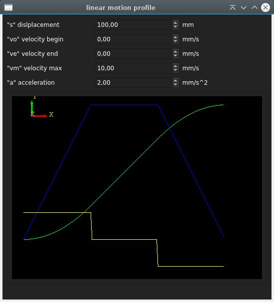
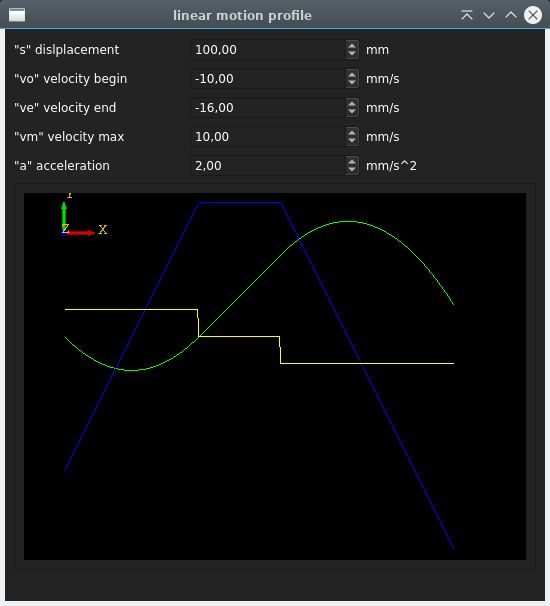
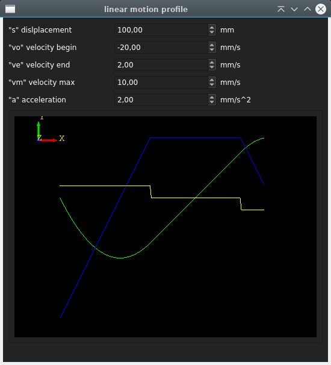

# Linear Motion Profile Calculator





## Overview

This C++ library provides a Linear Motion Profile Calculator that allows you to generate a linear motion profile based on the given inputs:

- Initial velocity (`vo`)
- Final velocity (`ve`)
- Maximum velocity (`vm`)
- Acceleration (`a`)
- Displacement (`s`)

The library calculates the motion profile and allows you to query the position, velocity, and acceleration at different points in time.
Negative vo,ve,s inputs are ok.

## Example Usage

```cpp
#include "linear_motion.h"

int main() {
    // Create a Linear Motion Profile object
    linear_motion *lm = new linear_motion();

    // Enable debugging (optional)
    lm->set_debug(true);

    // Set the curve values
    float vo = 0.0;  // Initial velocity
    float ve = 10.0; // Final velocity
    float vm = 5.0;  // Maximum velocity
    float a  = 2.0;  // Acceleration
    float s  = 50.0; // Displacement

    lm->set_curve_values(vo, ve, vm, a, s);

    // Iterate over time and retrieve position, velocity, and acceleration
    for (float t = 0; t < lm->get_curve_total_time(); t += 0.1) {
        float sr, vr, ar;
        lm->get_curve_at_time(t, sr, vr, ar);
        // Use sr, vr, and ar as needed
    }

    // Don't forget to free the allocated memory
    delete lm;

    return 0;
}


  


