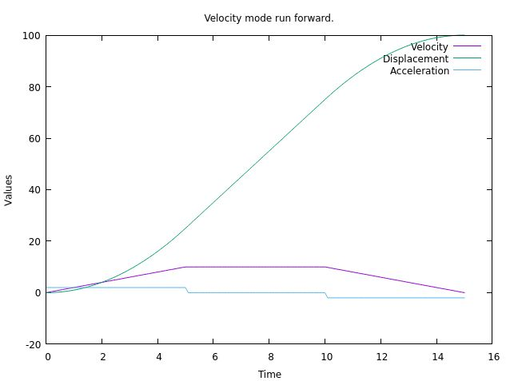

# Linear Motion Profile Calculator

- Position mode


- Velocity mode


- Velocity mode, motion stop sequence


- Velocity mode, motion forward



- Velocity mode, motion reverse


## Overview

This C-C++ library provides a Linear Motion Profile Calculator that allows you to generate a linear motion profile based on the given inputs:

- Initial velocity       (`vo`)
- Final velocity         (`ve`)
- Maximum velocity       (`vm`)
- Acceleration           (`a`)
- Displacement begin     (`so`)
- Displacement end       (`se`)         

The library calculates the motion profile and allows you to query the position, velocity, and acceleration at different points in time.

## Options

- Negative displacement begin input
- Negative displacement end input
- Negative velocity begin input
- Negative velocity end input

## Usage

- A positive maximum velocity input is valid for negative velocity inputs. 
- A positive acceleration value is valid for negative velocity inputs.

## Example Usage in c++

```cpp
#include "linear_motion.h"

int main() {
    double vo=0;            // Velocity begin.
    double ve=0;            // Velocity end.
    double vm=10;           // Velocity max.
    double a=2;             // Acceleration max.
    double so=0;            // Displacement begin.
    double se=100;          // Displacement end;
    double interval=0.2;    // Interval time.
    bool debug=1;           // Set debug output.
    bool debug_time=1;      // Set debug output.

    linear_motion *lm = new linear_motion();
    lm->set_debug(debug, debug_time);
    lm->set_curve_values(vo,ve,vm,a,so,se);

    double sr=0,vr=0,ar=0;  // Results for "s" displacement, "v" velocity , "a" acceleration.

    for(float t=0; t<lm->get_curve_total_time(); t+=interval){
        lm->get_curve_at_time(t,sr,vr,ar);
    }

    delete lm;
}
```
## Example Usage in c

```cpp

#include "linear_motion.h"

int main() {
    // Add a copy of the extern "C" functions :
    struct linear_motion *linear_ptr;
    extern linear_motion* lm_init_ptr();
    extern void lm_set_values(linear_motion *ptr,
                           double velocity_begin,
                           double velocity_end,
                           double velocity_max,
                           double acceleration_max,
                           double displacment,
                           bool debug);
    extern double lm_get_curve_ve(linear_motion *ptr);
    extern double lm_get_curve_total_time(linear_motion *ptr);
    extern const double* lm_get_curve_at_time(linear_motion *ptr, double t);

    // Init pointer :
    linear_ptr=lm_init_ptr();

    // Use functions :
    lm_set_values(linear_ptr, .. ..)
    double ve=lm_get_vurve_ve(linear_ptr);

    const double* array_ptr=lm_get_curve_at_time(linear_ptr,0.5*lm_get_curve_total_time(linear_ptr));
    double s=array_ptr[0];
    double v=array_ptr[1];
    double a=array_ptr[2];

    printf("s %f \n",s);
    printf("v %f \n",v);
    printf("a %f \n",a);
}
```
  
## Clone & run project using cmake

```
	git clone https://github.com/grotius-cnc/linear_motion.git
	cd linear_motion
	mkdir build
	cd build
	cmake ..
	make
```

## Edit project in Qt-designer

Open the `CMakeLists.txt` in Qt-designer.


## Unit test
```
	./runtest
	// Performing unit tests to validate code :
	// linear_motion().unit_test_displacement();
	// linear_motion().unit_test_position_mode(true);
	// linear_motion().unit_test_velocity_mode_run_forward(true);
	// linear_motion().unit_test_velocity_mode_run_reverse(true);
	// linear_motion().unit_test_velocity_mode_run_stop(true);
```

## Bugs

Please report bugs by creating a issue.

